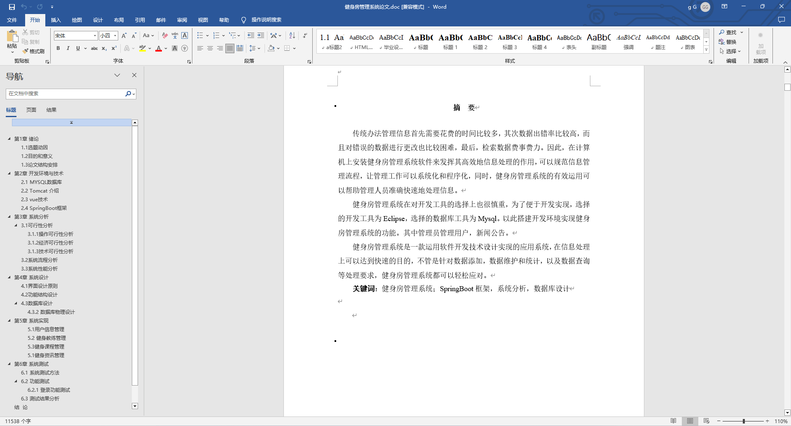
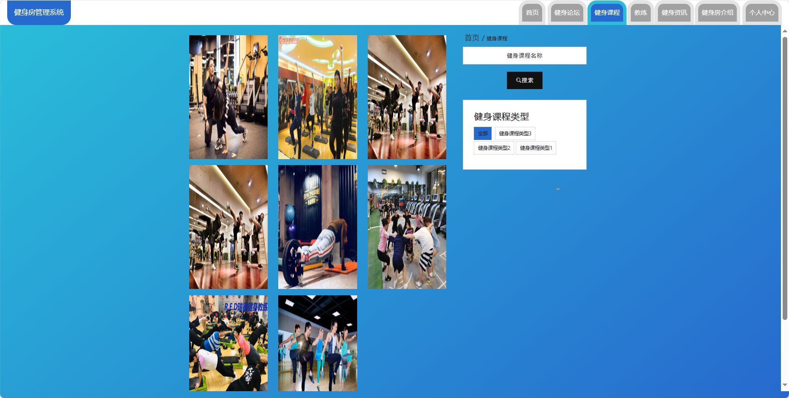
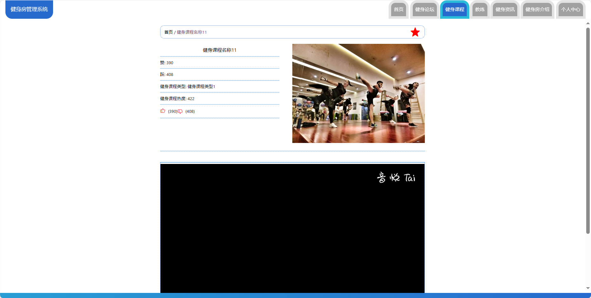
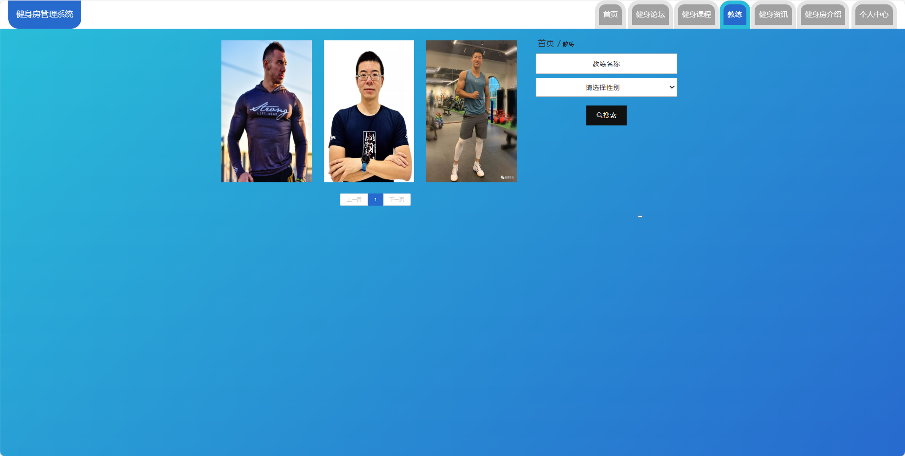
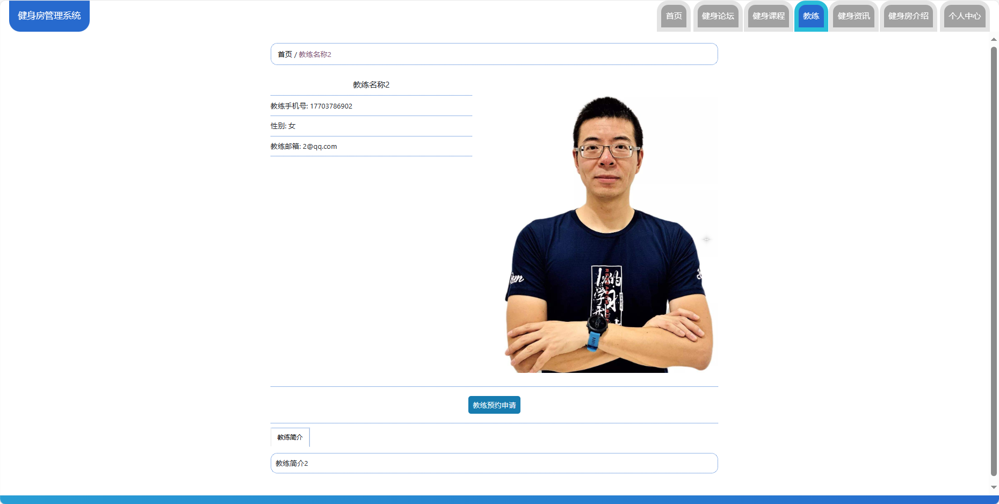
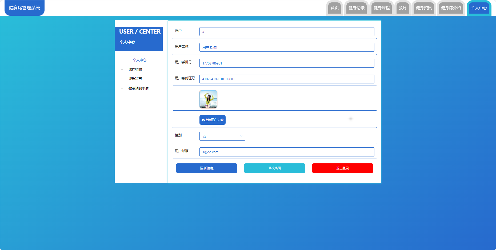
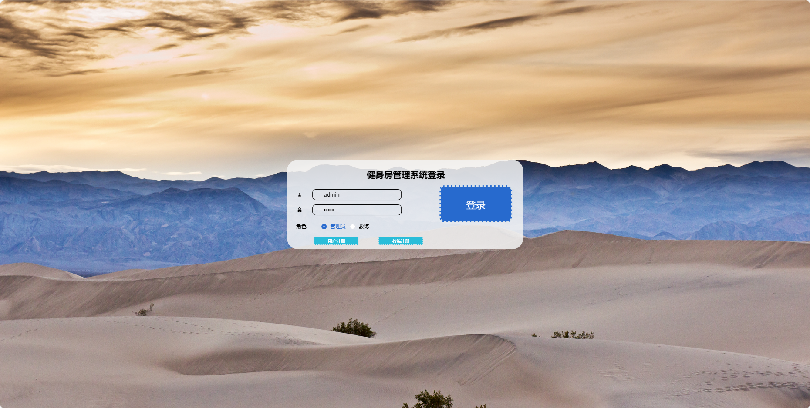
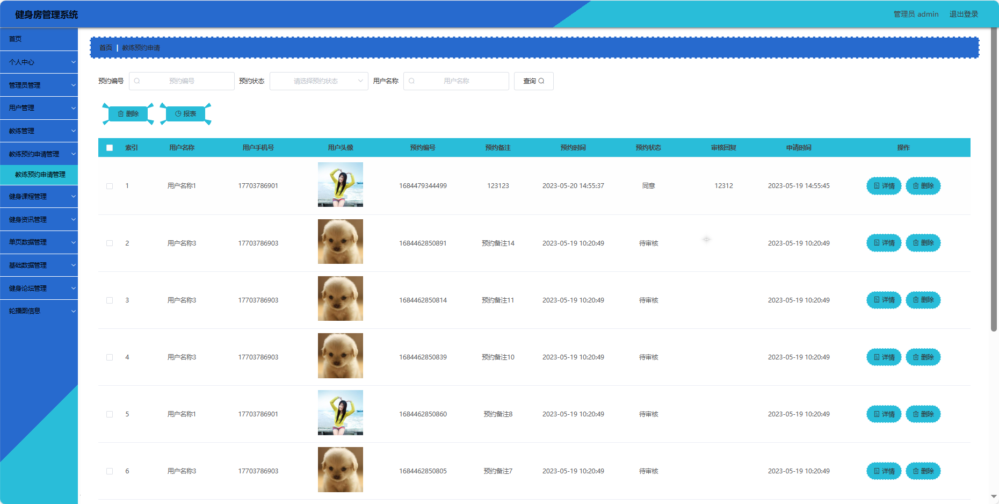
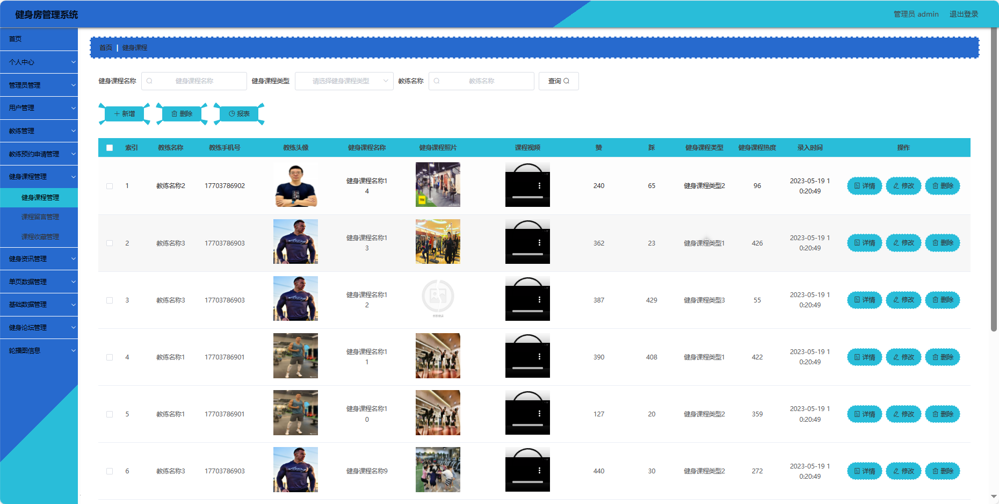

## 基于SpringBoot的健身房管理系统(程序+报告)

###  获取sql数据库文件: 从戎源码网 (https://armycodes.com/) QQ: 386869957 QQ群: 377586148
###  所有系统地址: (https://github.com/YuLin-Coder/AllProjectCatalog) 
###  所有项目以及源代码本人均调试运行无问题 可支持远程安装部署调试、定制修改、代码讲解

## 项目介绍
基于SpringBoot的健身房管理系统，系统包含三种角色：管理员、学员,教练主要功能如下。

【学员功能】

1. **首页：** 浏览最新的健身房信息。
2. **健身论坛：** 参与健身讨论，分享经验和建议。
3. **健身课程：** 查看和报名参加健身课程。
4. **教练：** 查看教练信息和排班，进行预约。
5. **健身资讯：** 获取最新的健身资讯和建议。
6. **健身房介绍：** 了解健身房的设施和特色。
7. **个人中心：** 管理个人信息，包括修改密码等。

【管理员功能】

1. **首页：** 查看整体系统的概况。
2. **个人中心：** 修改密码和管理个人信息。
3. **管理员管理：** 管理系统中的管理员账号。
4. **用户管理：** 管理学员的账号信息，包括审核注册。
5. **教练管理：** 管理教练的信息，包括添加、编辑和删除。
6. **教练预约申请管理：** 处理学员对教练的预约申请。
7. **健身课程管理：** 管理健身课程，包括添加、编辑和删除。
8. **健身资讯管理：** 发布和管理健身资讯。
9. **单页数据管理：** 管理健身房介绍等单页信息。
10. **基础数据管理：** 管理系统的基础数据，包括健身课程类型和资讯类型。
11. **健身论坛管理：** 管理健身讨论论坛的帖子和评论。
12. **轮播图信息：** 管理系统首页的轮播图。

【教练功能】

1. **首页：** 查看健身房信息。
2. **个人中心：** 修改密码和管理个人信息。
3. **教练预约申请管理：** 查看和处理学员的预约申请。
4. **健身课程管理：** 管理自己的健身课程，包括排班和内容。
5. **健身资讯管理：** 发布和管理健身资讯。
6. **健身论坛管理：** 参与健身讨论。

## 项目技术
- 编程语言：Java
- 数据库：MySQL
- 项目管理工具：Maven
- 前端技术：HTML、CSS、JavaScript、Jquery、Vue
- 后端技术：Spring、SpringMVC、MyBatis

## 运行环境
- JDK版本：JDK1.8及以上
- 开发工具：IDEA、Ecplise、Myecplise都可以
- 数据库: MySQL5.7及以上
- Maven：maven3.0及以上
- Node：14.14.0及以上

## 运行截图

